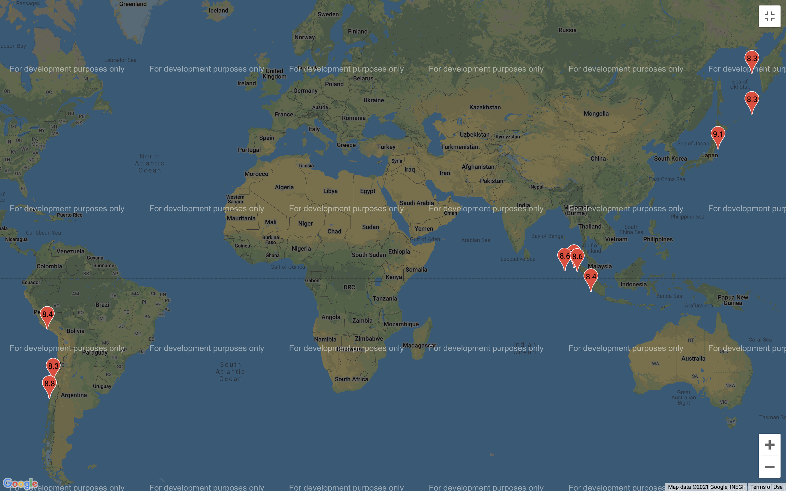
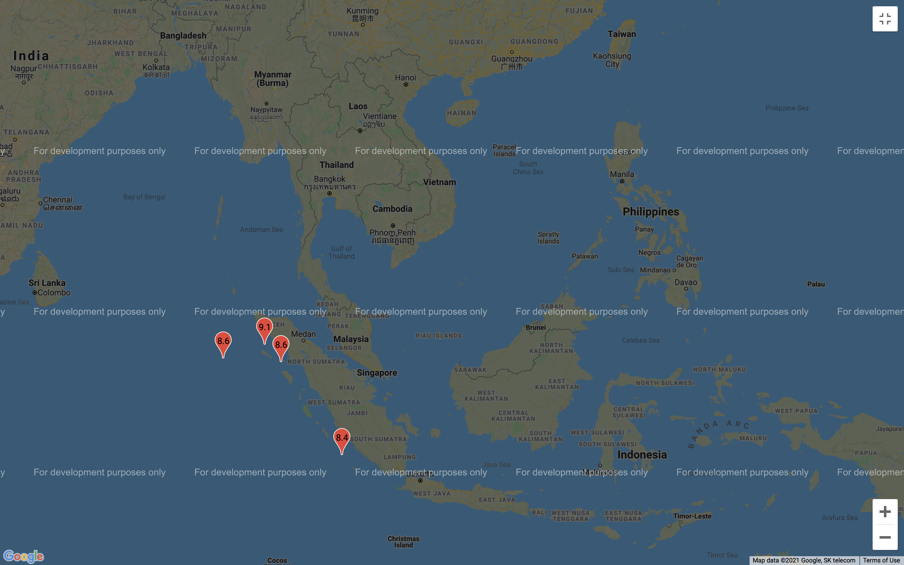

# Earthquake Analytics and Visualization using the Google Maps API

This project aims to make use of a data set on earthquakes to determine the coordinate locations of the earthquakes with the largest magnitudes and display these on a map. The magnitude of the earthquake is displayed within the location marker icon on the map.

  <b>Data set:</b>
Earthquakes table in index.sqlite db file consisting of earthquake data between 1970 and 2020 downloaded from the http://earthquake.usgs.gov API
  

The Python script creates a list of the largest earthquakes and feeds the latitude and longitude data to the where.js file. 
 

Opening where.html in a browser displays the Google Map with location markers pinpointing the earthquake locations for the <b>10 most intensive earthquakes in recent history</b>

 

